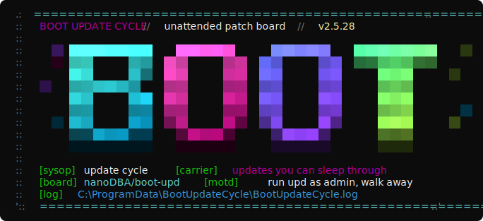
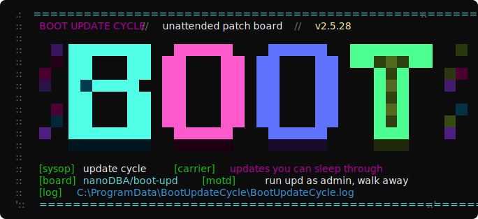
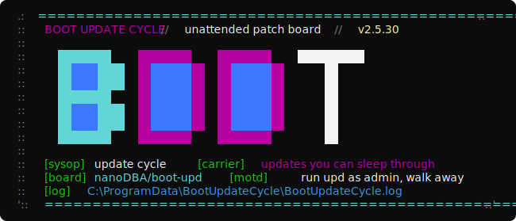

# Boot Update Cycle

**Run `upd` as admin. Walk away. Come back fully patched.**

A Windows boot-time automation tool that runs every package manager you have, reboots when updates require it, and repeats until no pending reboots remain — then self-destructs. Solves the "restart required" whack-a-mole problem once and for all.



The BBS-style splash defaults to the neon gradient theme above; two more ship with it (`upd splash` previews them all; switch with `BOOT_UPDATE_SPLASH_THEME=0|1|2`):

<details>
<summary>The other two themes</summary>





</details>

## What it updates

| Phase | Package Manager | Default | Notes |
|-------|----------------|---------|-------|
| 1 | **Winget** | On | User + machine scope on first run; machine-only after reboot |
| 2 | **Chocolatey** | On | `choco upgrade all -y` |
| 3 | **Windows Update** | On | Security, Critical, Definition updates (excludes SQL Server) |
| 4 | **AWS Tooling** | Off | Optional CLI v2 + AWS.Tools repair |
| 5 | **pip** | On | All outdated global packages |
| 6 | **npm** | On | All global packages |
| 7 | **Office 365** | On | Click-to-Run silent update |
| 8 | **PowerShell Modules** | On | All user-installed modules via `Update-Module` |
| 9 | **Scoop** | On | User-scoped; skipped under SYSTEM |
| 10 | **.NET Global Tools** | **Off** | High risk — can break SDK-dependent builds |
| 11 | **VS Code Extensions** | On | User-scoped; skipped under SYSTEM |

## Quick start

```
upd
```

That's it. Runs from an elevated command prompt, PowerShell, or the Run dialog (Win+R → `upd` → Ctrl+Shift+Enter).

`upd.cmd` auto-adds itself to your system PATH on first run, so it works from anywhere after that.

### Console views

Interactive runs use a compact progress view by default: current phase, overall progress,
phase results, warnings, and errors. The complete timestamped detail stream still goes to
`BootUpdateCycle.log`.

Press `v` at any time during an interactive run to cycle through:

| Mode | Console output |
|---|---|
| `Quiet` | Errors and final/reboot status only |
| `Normal` | The themed splash, progress, phase results, warnings, and errors (default) |
| `Verbose` | Normal plus detailed package-manager output |
| `Debug` | Verbose plus process IDs and heartbeat diagnostics |

Choose the initial view explicitly with `-OutputMode Quiet|Normal|Verbose|Debug`, or set
`OutputMode` in `Deploy-BootUpdateCycle.ps1`. Key polling and animated progress disable
themselves under SYSTEM, redirected output, and non-console hosts; file logging is unchanged.

On an interactive PowerShell 7.4+ console, the updater uses
[`PwshSpectreConsole`](https://github.com/ShaunLawrie/PwshSpectreConsole) for richer phase and
result lines. If no protected all-users copy is available, the pinned stable release is installed
from PSGallery under Program Files; user-writable module copies are never imported by the elevated
updater. Existing protected installations are left unchanged. Offline runs, older PowerShell
versions, `-WhatIf`, SYSTEM, redirected output, and any install/import failure automatically keep
the native renderer. The themed splash is independent of Spectre and remains unchanged.

To visually smoke-test animation without running any package updates:

```powershell
.\tools\Show-BootUpdateProgressDemo.ps1
```

The demo renders the same ten-frame spinner at the production 100 ms cadence and clears its
progress record when complete.

Built-in operations that can block for more than a moment run behind a process-tree-aware,
progress-pumped adapter, keeping both animation and `v` key handling responsive. Administrator-supplied
hooks intentionally retain same-scope execution semantics; a long hook must provide its own
console feedback because isolating it would change how hook variables and side effects work.

### What happens

1. Pre-flight checks validate disk space, network, battery, and conflicting installers
2. First iteration runs in **your** console (user context) — the only chance for user-scoped winget/Scoop/VS Code
3. If any updates need a reboot, a scheduled task is registered and `shutdown /r` fires
4. Post-reboot iterations run as SYSTEM via the scheduled task
5. Repeats until no pending reboots remain (max 5 iterations safety valve)
6. Self-destructs: removes the scheduled task, cleans up state

### Reboot delay

```
upd        # immediate reboot (0 sec delay)
upd 120    # 2-minute countdown — users can cancel with: shutdown /a
```

## Requirements

- **Windows 10/11**
- **PowerShell 7+** (`pwsh`)
- **Administrator privileges**

Package managers are auto-detected. Missing ones are skipped with a warning.

## Files

| File | Purpose |
|------|---------|
| `upd.cmd` | Entry point — run this |
| `Deploy-BootUpdateCycle.ps1` | Deploys scripts to ProgramData + runs first iteration |
| `Invoke-BootUpdateCycle.ps1` | The orchestrator — runs all updates, manages reboots |
| `Register-BootUpdateTask.ps1` | Standalone task registration (alternative to Deploy) |
| `Unregister-BootUpdateTask.ps1` | Emergency stop — removes the scheduled task |
| `Repair-AwsTooling.ps1` | Optional AWS CLI v2 + module maintenance |
| `tools/Initialize-BootUpdateWebhook.ps1` | Securely configures a notification webhook outside Git and task arguments |

## Monitoring

```powershell
# Live log tail
Get-Content "$env:ProgramData\BootUpdateCycle\BootUpdateCycle.log" -Tail 50 -Wait

# Cycle history (last 50 runs with package counts)
Get-Content "$env:ProgramData\BootUpdateCycle\BootUpdateCycle.history.json" | ConvertFrom-Json

# Windows Event Log
Get-WinEvent -FilterHashtable @{LogName='Application'; ProviderName='BootUpdateCycle'} | Select-Object -First 10
```

## Emergency stop

```powershell
# Cancel a pending reboot
shutdown /a

# Remove the scheduled task (stops the cycle)
Unregister-ScheduledTask -TaskName 'BootUpdateCycle' -Confirm:$false

# Full cleanup
& "$env:ProgramData\BootUpdateCycle\Uninstall.ps1" -RemoveFolder
```

## Configuration

Edit the `$Config` block in `Deploy-BootUpdateCycle.ps1`:

```powershell
$Config = @{
    MaxIterations         = 5       # Safety valve
    PackageTimeoutMin     = 30      # Hard timeout per package manager
    RebootDelaySec        = 120     # Countdown before reboot (0 = immediate)
    SkipPip               = $false
    SkipNpm               = $false
    SkipOffice365         = $false
    SkipAwsTooling        = $true   # Off by default
    SkipPowerShellModules = $false
    SkipScoop             = $false
    SkipDotnetTools       = $true   # Off by default — high risk
    SkipVscode            = $false
}
```

### Notification webhook

Never commit a Teams, Slack, or Discord webhook URL or place it in a scheduled-task
command line. Configure it once from an elevated PowerShell prompt; the tool prompts
without echo and stores the URL under ProgramData with access limited to SYSTEM and
local Administrators:

```powershell
./tools/Initialize-BootUpdateWebhook.ps1

# Remove it later
./tools/Initialize-BootUpdateWebhook.ps1 -Remove
```

The legacy `WebhookUrl` deployment setting remains as a one-time migration path. If
set, deployment immediately moves its value into the protected local file and clears
the in-memory configuration before registering a task. Do not save a real URL in a
tracked copy of `Deploy-BootUpdateCycle.ps1`.

### Extension-hook trust boundary

Pre-cycle, post-cycle, and `hooks.psd1` extensions must be located inside the deployed
BootUpdateCycle directory. The orchestrator rejects hooks outside that directory,
hooks reached through reparse points, and hooks whose file or parent directory grants
write access to Everyone, Authenticated Users, or the built-in Users group.

## Smart timeouts

Package managers get killed if they're truly stuck, but busy installs are left alone:

- **Idle timeout (5 min)**: If the entire process tree (winget + msiexec + setup.exe + children) has zero CPU activity for 5 minutes, it's stuck — kill it
- **Hard timeout (configurable)**: Absolute ceiling regardless of activity
- **Timed-out packages retry next boot** — not lost, just delayed

This means Visual Studio can install for 45 minutes (busy CPU = fine), but a hung winget source refresh gets killed in 5 minutes (zero CPU = stuck).

## License

MIT
