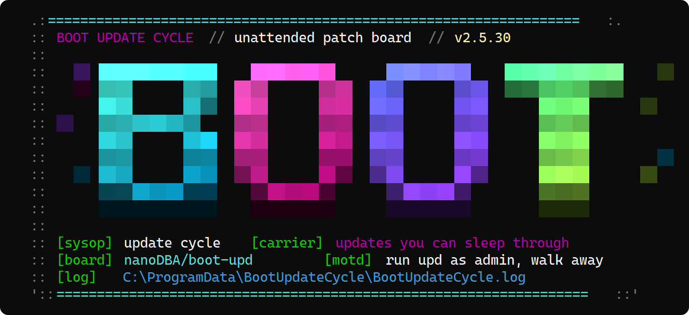
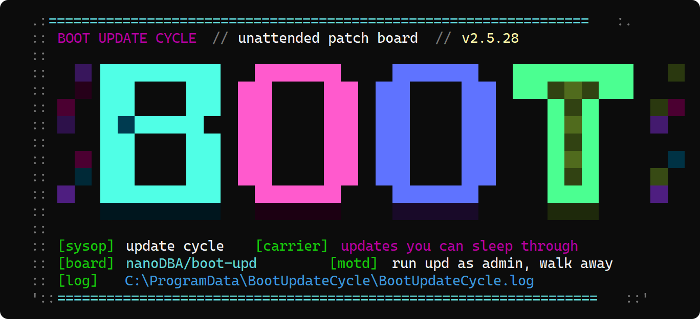
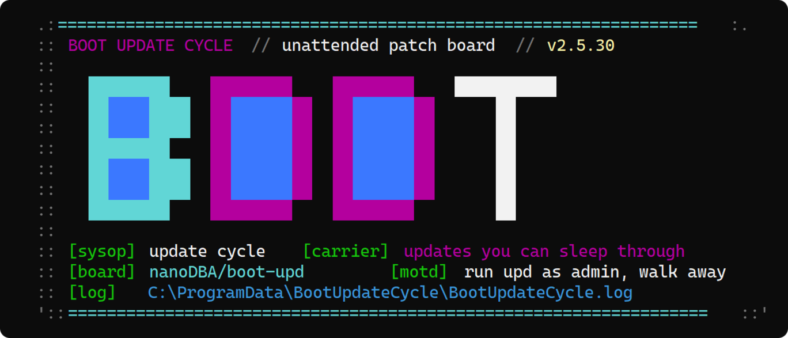
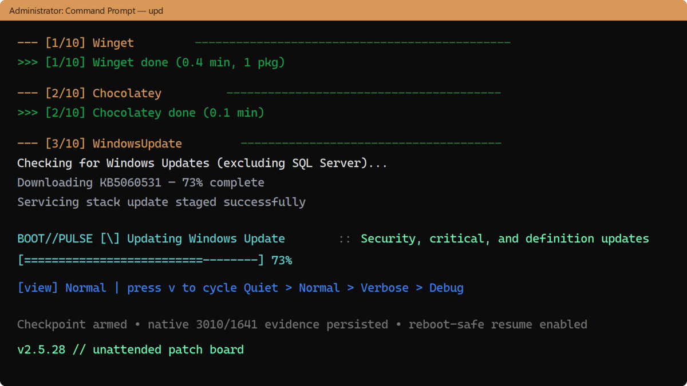
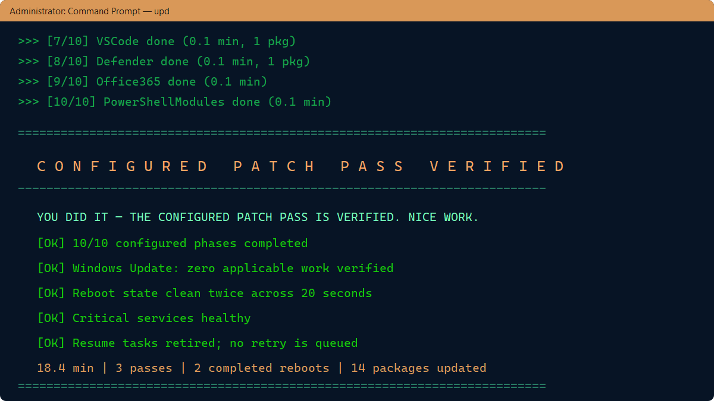

# Boot Update Cycle

**Run `upd` as admin. Walk away. Come back patched—or with a clear, reversible exception report.**

A Windows boot-time automation tool that runs every configured package manager, checkpoints its work, reboots when updates require it, and resumes until the configured scope verifies clean — then retires its resume tasks.



<a id="navigate"></a>
## 🧭 Navigate

- [Quick start](#quick-start)
- [See it in action](#updater-in-action)
- [What it updates](#what-it-updates)
- [Commands](#friendly-launcher)
- [How reboot/resume works](#what-happens)
- [Status and recovery](#status-and-recovery)
- [Security model](#security-model)
- [Configuration](#configuration) · [Testing](#testing)

<a id="quick-start"></a>
## 🚀 Quick start

Open **Windows PowerShell as Administrator**, paste this command, and press Enter:

```powershell
[Net.ServicePointManager]::SecurityProtocol=[Net.SecurityProtocolType]::Tls12; & ([ScriptBlock]::Create((Invoke-RestMethod -UseBasicParsing -TimeoutSec 30 'https://github.com/nanoDBA/boot-upd/releases/latest/download/Install-UpdCompat.ps1'))) -PromptForArguments
```

After the compatibility installer starts, it verifies every runtime asset against the
release bundle's SHA256 sidecars before installing the runtime bundle. At the
prompt, press Enter to use the defaults. After installation, everyday use is deliberately
short:

```powershell
upd          # update, reboot when required, and resume automatically
upd status   # show the current checkpoint and continuation tasks
upd logs     # create a sanitized support ZIP on the Desktop
upd help     # commands, short aliases, and every option
```

> [!IMPORTANT]
> `upd` installs software and can restart Windows immediately by default. Save your work
> first, or use `upd -r 120` for a two-minute reboot warning. Cancel a pending restart with
> `shutdown /a`.

Want to look around without changing the machine? These commands are read-only and do not
request elevation:

```powershell
upd splash
upd demo 12
upd plan -drv -r 120
upd version
```

**Trust boundary:** the one-liner trusts GitHub HTTPS and this project's latest release;
the downloaded compatibility installer then requires a valid SHA256 sidecar for every
runtime asset. Checksums protect integrity but are not publisher signatures. See
[Security model](#security-model) and the [version-pinned recovery path](#install-details-and-compatibility)
before using it in a controlled environment.

The BBS-style splash defaults to the neon gradient theme above; two more ship with it (`upd splash` previews them all; switch with `BOOT_UPDATE_SPLASH_THEME=0|1|2`):

<details>
<summary>The other two themes</summary>





</details>

## Updater in action

The default `Normal` view stays zoomed out while the animated `BOOT//PULSE` row shows the current operation:



When the configured work, convergence checks, reboot checks, service health, and terminal cleanup all pass, the final screen has some earned personality:



<sub>Representative v2.5.56 console captures rendered from the production UI text for deterministic, privacy-safe documentation; package counts and elapsed time are illustrative.</sub>

## What it updates

| Phase | Package Manager | Default | Notes |
|-------|----------------|---------|-------|
| 1 | **Winget** | On | User + machine scope; ARSO resumes user scope after reboot, with a delayed SYSTEM safety net |
| 2 | **Chocolatey** | On | `choco upgrade all -y` |
| 3 | **Windows Update** | On | Security, Critical, Definition updates (excludes SQL Server) |
| 4 | **AWS Tooling** | Off | Optional CLI v2 + AWS.Tools repair |
| 5 | **pip** | On | All outdated global packages |
| 6 | **npm** | On | All global packages |
| 7 | **Office 365** | On | Click-to-Run silent update |
| 8 | **PowerShell Modules** | On | All user-installed modules via `Update-Module` |
| 9 | **Scoop** | On | User-scoped; skipped under SYSTEM |
| 10 | **.NET Global Tools** | **Off** | High risk — can break SDK-dependent builds |
| 11 | **VS Code Extensions** | On | User-scoped; skipped under SYSTEM |
| 12 | **Microsoft Defender** | On | Signature refresh through `MpCmdRun.exe` |
| 13 | **Drivers / firmware** | **Off** | Explicit opt-in with `-drv` / `-fw` |
| 14 | **WSL / containers** | **Off** | Explicit opt-in; user-context work resumes at logon |

## Install details and compatibility

The [quick-start command](#quick-start) is the shortest supported fresh-install,
repair, and run path for an elevated Command Prompt, PowerShell, or Win+R.

If you prefer the downloaded bootstrap to remain visible in `%TEMP%` for inspection or
troubleshooting, use the equivalent download-and-run form:

```powershell
powershell.exe -NoProfile -ExecutionPolicy Bypass -Command "[Net.ServicePointManager]::SecurityProtocol=[Net.SecurityProtocolType]::Tls12; Invoke-WebRequest -UseBasicParsing 'https://github.com/nanoDBA/boot-upd/releases/latest/download/Install-UpdCompat.ps1' -OutFile ([IO.Path]::Combine([IO.Path]::GetTempPath(),'Install-UpdCompat.ps1')); & ([IO.Path]::Combine([IO.Path]::GetTempPath(),'Install-UpdCompat.ps1')) -CommandArguments run"
```

The short form verifies and installs the complete bundle first, then prompts for an `upd`
command and options; press Enter to run with defaults. To automate it, replace
`-PromptForArguments` with an explicit array such as
`-CommandArguments @('run','--drivers','--delay','120')`.

Both convenience commands trust GitHub HTTPS and the repository's current latest release.
The downloaded installer then verifies every runtime asset against its published SHA256
sidecar and installs to `Program Files\BootUpdateCycle`, or transactionally repairs the
existing `upd.cmd` PATH winner. For a version-and-hash-pinned bootstrap, use the stricter
compatibility command below.

Already installed:

```
upd
```

That's it. Runs from an elevated command prompt, PowerShell, or the Run dialog (Win+R → `upd` → Ctrl+Shift+Enter).

`upd.cmd` auto-adds itself to your system PATH on first run, so it works from anywhere after that.

### Friendly launcher

The launcher accepts both commands and typed run options. Help, previews, planning,
version, and status do not request elevation; only `run` starts the UAC-protected updater.

```text
upd help                         Full command and option reference
upd /?                           Same help (also ?, /help, -h, --help, usage)
upd splash                       Preview all splash themes; no updates
upd demo 12                      Run the production BOOT//PULSE animation for 12 seconds
upd fun 12                       Splash parade followed by the animation
upd update                       Refresh the checksummed launcher bundle and exit
upd aws                          Update/repair AWS CLI v2 and AWS.Tools
upd logs                         Export a sanitized diagnostic ZIP to the Desktop
upd repair                       Recover missing/corrupt launcher and core files
upd bootstrap                    Install/verify PowerShell 7, then show help
upd version                      Show the bundled version
upd status                       Show resume tasks and checkpoint state
upd uq                           Remove every recorded Winget quarantine pin
upd uq Corsair.iCUE.5            Remove one quarantine pin and reconcile its record
upd plan --drivers --delay 120   Resolve options without elevation or changes

upd                              Run with defaults
upd 120                          Legacy shorthand: run with a 120-second reboot warning
upd --delay 120 --drivers --firmware
upd --staged --output-mode Verbose
upd --wsl --containers --allow-metered
upd -ar                          Opt in to aggressive Winget repair/reinstall attempts
upd --exclude Teams,OneDrive --skip-office365
```

Short forms keep everyday commands light: `upd d 12`, `upd f`, `upd p -drv -r 120`,
`upd r -s -o Verbose`, `upd a`, `upd l`, `upd u`, and `upd v`. Short commands do not use a
leading dash; ambiguous dashed forms fail before they can reach the update path. Long
names remain available for scripts and discoverability.

A stable raw-argument bootstrap now checks the latest GitHub release before an operational
command reaches the typed parser. Every executable
asset must have a valid SHA256 sidecar or the refresh is rejected. These checksums detect
corruption but are not code-signing signatures. PowerShell files are
verified and installed first; `upd.cmd` is staged as `upd.cmd.next` and adopted only after
the current PowerShell launcher exits, after a second checksum and version check. The
requested arguments are dispatched through the newly installed typed launcher rather than
the stale in-memory copy. Use `upd u` to request the refresh explicitly or `-nu` to skip the
automatic check for one run. `upd repair` can bootstrap a missing launcher and repair a
missing or corrupt core bundle.

An already-running historical batch cannot benefit from code it has not downloaded: some
pre-v2.5.29 launchers parse the first token as a reboot delay before self-update is reachable.
For those installations, run this version-pinned compatibility bridge **after the old batch
has exited**. It verifies the installer against the hash embedded below, then the installer
verifies and transactionally replaces the complete release bundle before forwarding `aws`:

```powershell
$u='https://github.com/nanoDBA/boot-upd/releases/download/v2.5.59/Install-UpdCompat.ps1'; $f=Join-Path $env:TEMP 'Install-UpdCompat-v2.5.59.ps1'; Invoke-WebRequest $u -OutFile $f; if((Get-FileHash $f -Algorithm SHA256).Hash -ne '67662B3B02252FF6DE045FCDF28FB74D8DEB6FDA8080C46B1DAFC7BFBE54ABE3'){throw 'Compatibility installer hash mismatch'}; & $f -CommandArguments aws
```

This is the one-time chicken-and-egg escape hatch. It resolves the first `upd.cmd` on PATH,
stages outside cloud storage, preserves a rollback snapshot, detects sync races, and replaces
only runtime files. It deliberately does not use a mutable gist or `iex`.

Windows PowerShell 5.1 is supported as a bootstrap host. On an operational command,
`upd.cmd` installs PowerShell 7 side-by-side using WinGet when available, or a
Microsoft Authenticode-validated MSI on older Windows Server systems, then relaunches
the PS7 updater. Help and version remain read-only; preview/plan/status commands ask
the user to run `upd bootstrap` rather than silently installing anything. The updater
itself remains PowerShell 7-only so `Start-ThreadJob` and `ForEach-Object -Parallel`
execution are preserved.

Run `upd help` for the complete list, including provider opt-ins, skip switches,
timeouts, iteration limits, health/BitLocker controls, include/exclude filters, and
self-update control. `demo`, `fun`, and `splash` never deploy files, register tasks,
update packages, or reboot Windows.

### Console views

Interactive runs use a compact progress view by default: current phase, overall progress,
phase results, warnings, and errors. The complete timestamped detail stream still goes to
`BootUpdateCycle.log`. Raw Winget and Chocolatey output is retained separately in
`BootUpdateCycle.providers.log` for troubleshooting without overwhelming the normal run log.
Standalone `upd aws` output is captured in `BootUpdateCycle.aws.log`. These logs rotate
independently (three archives, 5 MB for core/AWS and 10 MB for provider detail) and the
active and archived files receive NTFS compression when the volume supports it.

Run `upd logs` (or `upd l`) to create a compressed diagnostic ZIP on the Desktop. The
export includes all three log streams and fails closed if its identity, network, or path
redaction checks detect material that should not leave the machine. Its single absolute
ZIP path is displayed and copied to the Windows clipboard for easy attachment.

Because AWS maintenance is opt-in, `upd aws` fully modernizes the requested tooling by
default: it verifies the current Amazon-signed modular modules, then removes validated
older modular versions and legacy `AWSPowerShell*` version directories. Use
`upd aws --keep-aws-legacy --keep-aws-old` only when compatibility requires preserving them.

Press `v` at any time during an interactive run to cycle through:

| Mode | Console output |
|---|---|
| `Quiet` | Errors and final/reboot status only |
| `Normal` | The themed splash, progress, phase results, warnings, and errors (default) |
| `Verbose` | Normal plus detailed package-manager output |
| `Debug` | Verbose plus process IDs and heartbeat diagnostics |

Choose the initial view explicitly with `-OutputMode Quiet|Normal|Verbose|Debug`, or set
`OutputMode` in `Deploy-BootUpdateCycle.ps1`. The interactive `BOOT//PULSE` row uses a
classic `| / - \` ASCII propeller with the existing 48-step cyan, blue, magenta, and acid-green
glow. Motion and color advance independently, preserving the gradual fade without abrupt flashes.
ASCII status text is kept immutable; non-ASCII glyphs are represented safely in the live row while
remaining untouched in the log. Key polling and animation disable themselves under SYSTEM,
redirected output, and non-console hosts; file logging is unchanged.

On VT consoles, steady-state frames overwrite the owned row in place to avoid ConsoleHost flicker;
a full erase is reserved for width changes, ordinary output, mode transitions, and cleanup.

All console rendering is built in; the updater does not install or import a third-party TUI module.
Phase headers and results use native ANSI/console output, and the themed splash remains unchanged.

To visually smoke-test animation without running any package updates:

```powershell
.\tools\Show-BootUpdateProgressDemo.ps1
```

The demo renders the same four-frame `BOOT//PULSE` propeller and interpolated neon gradient at the production
100 ms cadence, includes the photographed Windows Update status text, accepts live `v` mode
cycling, and restores its console row and cursor when complete.

Built-in operations that can block for more than a moment run behind a process-tree-aware,
progress-pumped adapter, keeping both animation and `v` key handling responsive. Administrator-supplied
hooks intentionally retain same-scope execution semantics; a long hook must provide its own
console feedback because isolating it would change how hook variables and side effects work.

### What happens

1. Pre-flight checks validate disk space, network, battery, and conflicting installers
2. First iteration runs in **your** console (user context) — the only chance for user-scoped winget/Scoop/VS Code
3. Before mutation, two reboot-signal probes span a 20-second servicing-settle window. CBS, Windows Update Agent, real file replacements, protected Windows-file deletes, and provider-native reboot results are hard barriers; delete-only application/cloud/temp housekeeping is reported as an advisory
4. Native `3010`/`1641`, Chocolatey `350`/`1604`, and `Microsoft.Update.SystemInfo.RebootRequired` results are persisted immediately instead of waiting for registry flags to appear
5. Verified resume tasks are armed before updates start: user-at-logon plus a delayed SYSTEM fallback, with dated watchdogs for canceled shutdowns and deferred retries
6. `shutdown /g` restarts Windows; the checkpoint resumes automatically, preserves successful provider phases, preserves user-only work for user context, and retries only incomplete or interrupted work
7. A successful online Windows Update assessment is reusable for six hours—even across reboots—only after an offline WUA catalog check confirms zero applicable work and the update source, scope, and recent servicing history fingerprints still match
8. Completion requires every enabled phase, a zero-applicable Windows Update assessment, and two probes with no blocking reboot evidence (max 5 completed reboot safety valve). Optional third-party cleanup remains visible but cannot create a reboot loop
9. Hooks run, resume tasks and transient state are removed and verified absent, and only then does the final screen congratulate the user and send the success notification
10. If explicit aggressive mode quarantined a persistent Winget failure, its durable record survives cleanup and the final screen reports degraded completion with an `upd uq` reversal command

### Reliability lineage

The reboot design intentionally borrows proven boundaries instead of treating every registry
artifact as equally authoritative:

- [Boxstarter](https://github.com/chocolatey-community/boxstarter) checkpoints around package work and recognizes provider-native reboot results rather than restarting an entire provisioning plan from zero.
- [Microsoft DSC](https://learn.microsoft.com/powershell/dsc/configurations/reboot-a-node) resumes dependency-ordered resources after reboot and makes pending-file-rename checks policy-selectable.
- [Ansible's Windows Update implementation](https://github.com/ansible-collections/ansible.windows/blob/main/plugins/modules/win_updates.ps1) uses the Windows Update Agent API and per-update results before and after installation.
- [PendingReboot](https://github.com/bcwilhite/PendingReboot) explicitly supports excluding pending-file-renames because antivirus and other background products commonly create false positives.
- [Microsoft's `MoveFileEx` contract](https://learn.microsoft.com/windows/win32/api/winbase/nf-winbase-movefileexa) distinguishes a blank-destination delete from a source/destination replacement; boot-upd keeps replacements blocking while treating non-system housekeeping as advisory.
- [Chocolatey's documented exit codes](https://docs.chocolatey.org/en-us/choco/commands/install/#exit-codes) distinguish successful reboot requests (`1641`, `3010`) from reboot barriers that leave work incomplete (`350`, `1604`).

### Reboot delay

```
upd        # immediate reboot (0 sec delay)
upd 120    # 2-minute countdown — users can cancel with: shutdown /a
```

## Requirements

- **Windows 10/11**
- **PowerShell 7+ runtime** (`upd.cmd` can install it side-by-side from Windows PowerShell 5.1)
- **Administrator privileges**

Package managers are auto-detected. Missing ones are skipped with a warning.

## Files

| File | Purpose |
|------|---------|
| `upd.cmd` | Entry point — run this |
| `tools/Invoke-UpdBootstrap.ps1` | Stable raw-argument preflight and verified current-launcher handoff |
| `tools/Invoke-UpdLauncher.ps1` | Typed commands, compact aliases, UAC boundary, and runtime-bundle updates |
| `tools/Install-UpdCompat.ps1` | One-time repair bridge for historical batch parsers |
| `tools/Install-PowerShell7.ps1` | Windows PowerShell 5.1-compatible PS7 bootstrap |
| `Deploy-BootUpdateCycle.ps1` | Deploys scripts to ProgramData + runs first iteration |
| `Invoke-BootUpdateCycle.ps1` | The orchestrator — runs all updates, manages reboots |
| `Register-BootUpdateTask.ps1` | Standalone task registration (alternative to Deploy) |
| `Unregister-BootUpdateTask.ps1` | Emergency stop — removes the scheduled task |
| `Repair-AwsTooling.ps1` | Optional AWS CLI v2 + module maintenance |
| `Export-BootUpdateDiagnostics.ps1` | Sanitized, compressed diagnostic bundle export |
| `tools/Initialize-BootUpdateWebhook.ps1` | Securely configures a notification webhook outside Git and task arguments |

<a id="status-and-recovery"></a>
## 🛟 Status and recovery

Start with the built-in commands; they keep the common support path short and preserve
useful evidence:

```powershell
upd status    # checkpoint, resume tasks, and reversible Winget quarantines
upd logs      # sanitized compressed diagnostics on the Desktop
upd repair    # restore checksummed launcher/core files
upd update    # refresh the verified source bundle without starting an update cycle
```

If explicit `-ar` mode quarantines a repeatedly failing Winget package, completion is
reported as **complete with quarantine**, never fully patched. The durable status record
includes the reversal command:

```powershell
upd uq Package.Id    # remove one blocking pin
upd uq               # remove all recorded blocking pins
```

Records are removed only after Winget confirms that the corresponding pin was removed.

### More monitoring

```powershell
# Live log tail
Get-Content "$env:ProgramData\BootUpdateCycle\BootUpdateCycle.log" -Tail 50 -Wait

# Unabridged package-manager transcript
Get-Content "$env:ProgramData\BootUpdateCycle\BootUpdateCycle.providers.log" -Tail 100 -Wait

# Sanitized support bundle on the Desktop (short form: upd l)
upd logs

# Cycle history (last 50 runs with package counts)
Get-Content "$env:ProgramData\BootUpdateCycle\BootUpdateCycle.history.json" | ConvertFrom-Json

# Windows Event Log
Get-WinEvent -FilterHashtable @{LogName='Application'; ProviderName='BootUpdateCycle'} | Select-Object -First 10
```

### Emergency stop

```powershell
# Cancel a pending reboot
shutdown /a

# Remove the scheduled task (stops the cycle)
Unregister-ScheduledTask -TaskName 'BootUpdateCycle' -Confirm:$false

# Full cleanup
& "$env:ProgramData\BootUpdateCycle\Uninstall.ps1" -RemoveFolder
```

<a id="security-model"></a>
## 🔐 Security model

- Release self-update fails closed when an executable asset or valid SHA256 sidecar is
  missing, malformed, or mismatched.
- The running batch launcher is updated through a temporary trampoline so it never
  replaces the file that `cmd.exe` is actively reading.
- Scheduled continuation arguments contain configuration references, not webhook bearer
  credentials. Webhook secrets live in an administrator/SYSTEM-protected local file.
- Administrator hooks must remain under the protected deployed directory and pass path,
  ACL, reparse-point, and optional signature/hash checks before elevated execution.
- Diagnostic export redacts identities, network addresses, URLs, registry paths, and local
  paths, then verifies the sanitized output before creating the ZIP.
- Aggressive Winget repair is opt-in (`-ar`). An identical persistent failure can be moved
  to a reversible blocking pin, which is recorded outside transient checkpoint state and
  shown by `upd status`.

For the most conservative bootstrap, use the version-and-hash-pinned command in
[Install details and compatibility](#install-details-and-compatibility). Never commit real
webhook URLs or other credentials to this public repository. Report vulnerabilities through
GitHub's [private vulnerability reporting](https://github.com/nanoDBA/boot-upd/security/advisories/new); otherwise open a minimal public issue
without secrets or exploit details so a private channel can be arranged.

## Configuration

Edit the `$Config` block in `Deploy-BootUpdateCycle.ps1`:

```powershell
$Config = @{
    MaxIterations         = 5       # Maximum completed reboot cycles
    MaxRetryPasses        = 5       # Consecutive failed recovery passes per boot
    PackageTimeoutMin     = 30      # Hard timeout per package manager
    RebootDelaySec        = 120     # Countdown before reboot (0 = immediate)
    SkipPip               = $false
    SkipNpm               = $false
    SkipOffice365         = $false
    SkipAwsTooling        = $true   # Off by default
    SkipPowerShellModules = $false
    SkipScoop             = $false
    SkipDotnetTools       = $true   # Off by default — high risk
    SkipVscode            = $false
}
```

### Notification webhook

Never commit a Teams, Slack, or Discord webhook URL or place it in a scheduled-task
command line. Configure it once from an elevated PowerShell prompt; the tool prompts
without echo and stores the URL under ProgramData with access limited to SYSTEM and
local Administrators:

```powershell
./tools/Initialize-BootUpdateWebhook.ps1

# Remove it later
./tools/Initialize-BootUpdateWebhook.ps1 -Remove
```

The legacy `WebhookUrl` deployment setting remains as a one-time migration path. If
set, deployment immediately moves its value into the protected local file and clears
the in-memory configuration before registering a task. Do not save a real URL in a
tracked copy of `Deploy-BootUpdateCycle.ps1`.

### Extension-hook trust boundary

Pre-cycle, post-cycle, and `hooks.psd1` extensions must be located inside the deployed
BootUpdateCycle directory. The orchestrator rejects hooks outside that directory,
hooks reached through reparse points, and hooks whose file or parent directory grants
write access to Everyone, Authenticated Users, or the built-in Users group.

## Smart timeouts

Package managers get killed if they're truly stuck, but busy installs are left alone:

- **Idle timeout (5 min)**: If the entire process tree (winget + msiexec + setup.exe + children) has zero CPU activity for 5 minutes, it's stuck — kill it
- **Hard timeout (configurable)**: Absolute ceiling regardless of activity
- **Timed-out packages retry next boot** — not lost, just delayed

This means Visual Studio can install for 45 minutes (busy CPU = fine), but a hung winget source refresh gets killed in 5 minutes (zero CPU = stuck).

## Testing

Testing is split into explicit confidence gates rather than a single test count. See [Testing Boot Update Cycle](docs/TESTING.md), or run `./tools/Invoke-TestGates.ps1` from an elevated PowerShell 7 console.

## License

MIT
