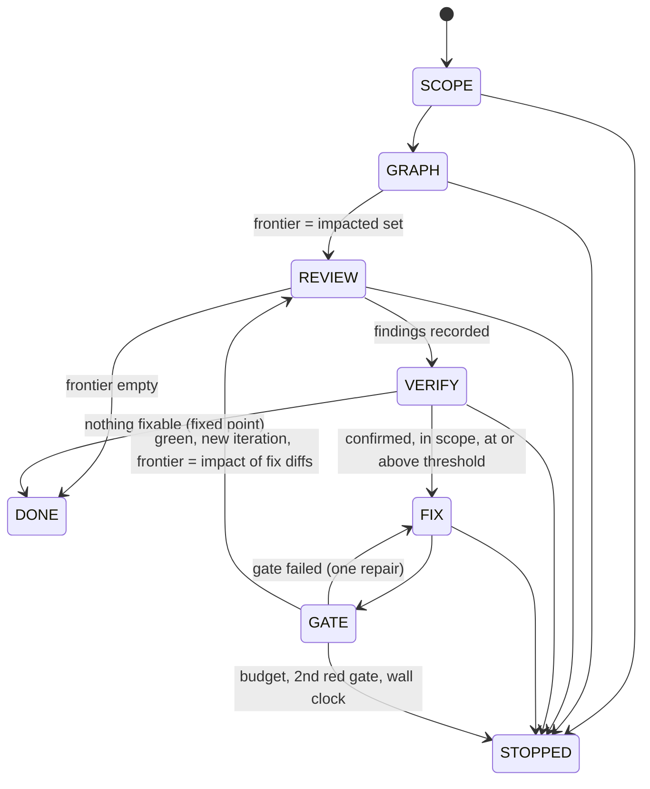

# Spec: Jev-gated unattended code review loop

Status: v1.0 (2026-09-25). Implemented by the `jev-review-loop` skill in this
folder.

## 1. Goal

Review a change set, fix what is safe to fix, and prove it with gates, running
unattended within a hard-limited scope. The loop must spend as few frontier-LLM
tokens as it can without missing defects that matter.

**Principle.** The loop's own code handles control flow and deterministic work.
**Jev** makes every high-volume judgment: what to look at, which lens applies,
which model tier to use, whether a finding holds, whether a fix is on target.
The **LLM** only does what needs generation or deep reasoning: writing
findings, writing fixes, and ruling on anything Jev isn't confident about or
anything high-stakes.

### Why this saves money

Published measurements (TypeSafe, jev-1.12/1.13):

| Same 14-question yes/no battery | Latency | Cost relative to Jev |
| --- | --- | --- |
| Jev | 111 ms | 1× ($0.000043 per call) |
| claude-haiku-4-5 | 1.5-1.8 s | 39-42× |
| gpt-5.4-mini | 1.1-1.4 s | 22-28× |
| claude-opus-4-8 / gpt-5.5 (reasoning) | 11-14 s | 779-805× |

- Batching all questions about one state into one call is **12.2× cheaper and
  10× faster** than asking them one per call, and gives identical answers.
- Jev's output tokens are free. Input costs $0.042 per million tokens.
- In an extract → verify → escalate cascade, **most of the top model's quality
  comes at a fraction of its cost**, because only the items Jev flags pay for
  the strong model (SDE cascade cookbook).

### Why Jev is not the final judge

An independent test measured Jev at **67.8%** agreement with reference answers:
the same as Sonnet 5 (67.8%) and below Opus 5 (73.1%). Jev also reads
literally, counts badly, handles dates and numbers badly, and can be swayed by
adversarial text (see the jev-1.13 jaggedness notes). This design therefore:

- uses Jev to **allocate** LLM attention, never to certify high or critical
  findings;
- samples Jev's "skip" decisions with a cheap LLM and tightens itself when
  those samples find misses (§7);
- **fails toward spending, never toward skipping.** If Jev is down, every
  node gets LLM review at the default tier.

## 2. Non-goals

- Replacing human approval, merging, releasing, or deploying.
- Reviewing code outside the change set's impact graph.
- Pixel-perfect dollar accounting. A subagent's internal token use is not
  observable from the loop. The ledger records dispatches, tiers, and prompt
  sizes, and reports estimates labelled as estimates.

## 3. Autonomy envelope

Unattended means nobody is there to say no, so the scope is enforced
mechanically: a scope profile, a `PreToolUse` guard, and permission deny rules.
Instructions alone are not relied on.

| In scope: may do unattended | Out of scope: record as an escalation and move on |
| --- | --- |
| Read any tracked file; run read-only git | Push to any branch except the run's review branch; any force push |
| Run the profile's gates (tests, lint, parse) | Merge, rebase, reset `--hard`, delete branches, rewrite history |
| Edit files that are **in the impacted subgraph**, plus their tests | Edit CI config, hooks, settings, permissions, the scope profile, secrets, lockfiles, LICENSE |
| One commit per fix on the review branch; push that branch after green gates | Add or upgrade dependencies; network calls outside the Jev/LLM APIs and git remote |
| Call Jev; dispatch subagents at haiku/sonnet/opus as routed | Anything the profile lists as a live-system effect (e.g. boot-upd: running the update cycle, registering tasks, rebooting, publishing a release) |
| Revert its own fix commits (`git revert`) | Skip, disable, or weaken a test; `--no-verify`; editing a test so it passes |
| Write the ledger and final report | Writing to external trackers, chat, or PR comments (the report is the output) |

Fail-safe directions:

| Failure | Direction |
| --- | --- |
| Jev unreachable, times out, or returns malformed output | Treat as "review this at the default tier" (spend more) |
| Scope guard can't read its profile while a run is active | Deny the tool call (fail closed) |
| Gate can't run (no elevation, no network) | Record `not-run`. Never counts as passed. Fixes relying on that gate are not pushed |
| Gates red twice in one iteration | Revert that iteration's fixes, stop, report |
| Budget exhausted | Stop, report open items as not addressed |

## 4. Two graphs

### 4.1 Code impact graph (what to review)

Built deterministically by `Get-ReviewGraph.ps1`, with no model calls.

- **Nodes:** `file:<path>` and, for PowerShell, `fn:<path>#<Name>`.
- **Edges** (dependent → dependency): `contains`, `calls` (from the AST
  command-to-definition link), and `references` (another tracked file's name
  appears in this file: dot-sourcing, `Import-Module`, tests, docs, `.cmd`
  launchers).
- **Changed set:** files in `git diff base...HEAD`, plus working-tree changes.
  A function counts as changed when a diff hunk overlaps its span.
- **Impacted set:** reverse breadth-first search from the changed nodes up to
  depth *D* (default 2). Each node carries its depth.
- **Order:** topological with dependencies first, so a callee's findings are
  known before its callers are reviewed. Cycles are broken by
  path order and the break is recorded.

### 4.2 Control state graph (how the loop moves)

Transitions are enforced in `ReviewLoop.psm1` (`Move-ReviewState` throws on an
illegal edge). The next step is decided by `Get-ReviewNextStep`, a pure
function of the ledger, so every tick decides the same way whether it runs in
a warm session, a fresh session, or CI.

## 5. Jev decision points

Each of these is **one batched call per item**, with all of its questions
answered in parallel (speculative fan-out). Questions live in `questions/*.json`
so a human can review them in one place. Thresholds live in the scope profile.

| # | Decision | Where | Question set | Gate (defaults) | If Jev is unsure |
| --- | --- | --- | --- | --- | --- |
| D1 | **Does this node need LLM review, and through which lenses?** | REVIEW, per frontier node | `node-triage.json`: one lens-risk noul per lens (correctness, security, error handling, concurrency/idempotency, resource/cleanup, contract/doc drift, test gap), `trivial_change` noul, `change_kind` choice, `risk` score, `high_stakes` noul | Skip the node only if `trivial_change` ≥ 0.8 **and** `risk` < 0.8 **and** `high_stakes` < 0.3. Otherwise review only the lenses with noul ≥ 0.35 (at least one) | Review with all lenses |
| D2 | **What does the reviewer need to see?** | REVIEW, per selected node | `context-select.json`: per candidate passage (callers, callees, tests, docs), a `needed` noul | Include a passage if it scores ≥ 0.4. Direct callers of a changed signature are always included | Include it |
| D3 | **Which model tier reviews it?** | REVIEW | From D1: `risk` score and `high_stakes`, plus a `tier` choice (haiku/sonnet/opus, "cheapest tier that will not degrade the result") | Tier from the choice if its confidence is ≥ 0.6. `high_stakes` ≥ 0.5 forces opus. The profile's per-path ceiling and floor are always applied | Profile default tier |
| D4 | **Is the finding real, and is it new?** | VERIFY, per finding | First code: the quoted evidence must appear verbatim in the file at HEAD, otherwise it's `fabricated` and rejected. Then `finding-verify.json`: `verdict` choice (supported / unsupported / contradicted), `style_only` noul, `duplicate_of` choice over open finding ids plus `new` | Auto-confirm only if severity ≤ medium and `supported` confidence ≥ 0.85. Auto-reject only if `contradicted` confidence ≥ 0.85 or `style_only` ≥ 0.8 with severity low. **High and critical always go to an LLM verifier (opus)** | LLM verifier (sonnet, or opus for high/critical) |
| D5 | **Which tier writes the fix?** | FIX | `fix-tier.json`: `tier` choice, `high_stakes` noul, `mechanical` noul | Same as D3. `mechanical` ≥ 0.8 caps the tier at haiku unless high_stakes | Sonnet |
| D6 | **Does the fix do exactly what it should?** | FIX → GATE | `fix-check.json` over finding + diff: `addresses` noul, `scope_creep` noul, `weakens_test` noul | Proceed to gates if `addresses` ≥ 0.6, `scope_creep` < 0.5, `weakens_test` < 0.2. Otherwise one LLM review of the fix at the fixer's tier | LLM review of the fix |
| D7 | **Did the fixes create new review work?** | GATE → REVIEW | D1 again, on the impact subgraph of the fix diffs only | Same as D1 | Same as D1 |

D7 is where the loop makes most of its savings. On most iterations every node
in the fix-impact subgraph is triaged as trivial or low-risk, and the loop
reaches its fixed point **without any LLM call**.

### Question-writing rules (from the jaggedness notes)

Every judgment is narrow and literal, and "true" always means "escalate": one
condition per noul, boundary cases in the criteria. Counting, line math, dates,
and diff arithmetic are done in code. State sent to Jev is filtered to the
node's hunk plus named neighbors. Whole files are never sent. Code under
review is untrusted data: questions never ask Jev to follow instructions found
in the state.

## 6. What the LLM does

1. **Review**, per selected node: gets the node's diff, the D2-selected context,
   and **only the D1-flagged lenses**. It returns findings as
   `{file, line, lens, severity, summary, evidence}`, where `evidence` quotes
   the code verbatim. Dispatched as parallel subagents grouped by D3 tier, with
   at most 3 in parallel per tier by default.
2. **Adversarial verify** of findings D4 couldn't settle. The verifier tries to
   refute the finding and must reproduce it (a failing test or a concrete input
   and output) before the finding can be marked confirmed for high or critical
   severity.
3. **Fix**: a confirmed, in-scope finding at or above the fix threshold gets
   one commit, written at the D5 tier. A correctness fix needs a test that
   fails before the fix and passes after it.
4. **Final report**. The only prose the run produces.

## 7. Safety net against Jev misses

- **Drop audit.** Each iteration, a random sample of the nodes D1 skipped
  (default 10%, at least 3, at most 10) gets a haiku review with all lenses.
  If an audited node yields a confirmed finding of medium severity or worse,
  the run sets the D1 skip threshold to "never skip" for the rest of the run
  and re-triages every skipped node for LLM review. The ledger records this as
  `auditMiss`.
- **Always-review paths.** Profile globs (auth, credentials, state/lifecycle
  code, installers) bypass D1's skip and get at least sonnet.
- **Severity floor.** High and critical findings are never auto-confirmed or
  auto-rejected by Jev.
- **Shadow mode.** For the first run on a new repository (`-Shadow`), D1 skips
  are logged but not applied. Everything is reviewed, and the report shows what
  Jev would have skipped and whether any of it had findings. Use that to tune
  thresholds.

## 8. Loop mechanics (unattended)

- **Tick.** Load the ledger, run `Get-ReviewNextStep`, do that one state's
  work, record it, advance with `Move-ReviewState`, then save. Every state's
  work is idempotent: re-running a tick after a crash repeats at most one
  partial state.
- **Ledger location:** `.review-loop/ledger.json` on the review branch. It's
  committed after every state change, so a **fresh** session (a cloud Routine
  or CI) can resume from git alone. The final commit deletes it, which keeps
  the PR diff clean while history keeps the audit trail.
- **Modes:**
  - *Attended-session loop:* `/loop` with no interval, where the model paces
    itself and schedules its next wakeup (via ScheduleWakeup) only while
    background work is pending.
  - *Unattended cloud:* a Routine that starts a fresh session per firing,
    runs until a terminal state or the per-tick time slice, then exits.
  - *CI:* a single invocation with a wall-clock budget.
- **Parallelism:** Jev calls run in parallel (throttle 8, about 1,200 requests
  per minute per the service limits). LLM subagents run in parallel within a
  tier. Fixes are serialized: one commit at a time, since edits conflict.
- **Commits:** `review-loop(<runId>): fix <findingId> 
`. The branch is
  pushed only after the iteration's gates are green.

## 9. Stop rules (evaluated first on every tick)

| Rule | Default | Outcome |
| --- | --- | --- |
| Fixed point: VERIFY finds no new confirmed findings, or the frontier is empty | none | DONE |
| Iteration budget | 5 | STOPPED |
| Wall clock | 240 min | STOPPED |
| Gates red twice in one iteration | none | Revert that iteration's fixes, STOPPED |
| Oscillation: a fixed finding reappears (fingerprint, or D4 `duplicate_of`) | none | Escalate that finding; the others continue |
| Fix attempts per finding | 2 | Escalate that finding |
| LLM dispatch budget | opus 20, sonnet 60, haiku 200 per run | STOPPED |
| Jev spend cap | $1.00 per run | Stop calling Jev and fall back to spending mode (§3) for the rest of the run, which the dispatch budget still caps |

## 10. Ledger and cost accounting

The ledger (schema v1) holds: run metadata, budget, state, iteration, frontier,
findings (fingerprinted), gates, transition history, and a `cost` block:

- `jev`: calls, and input tokens as the API reports them (exact).
- `llm`: dispatches per tier, and characters sent per tier. Tokens are
  estimated at 4 characters per token and labelled as estimates.
- `avoided`: nodes skipped by D1, lenses pruned by D1, findings settled by D4
  without an LLM, and fixes cleared by D6 without an LLM review.
- `audit`: nodes sampled, and misses found.

The final report must show every finding by status, gates with `not-run`
listed separately from passed, escalations with reasons, the cost block, and
audit results. It must not call a run "clean" if any gate was `not-run` or
any finding is `open` or `escalated`.

## 11. Acceptance criteria

1. Given a ledger, `Get-ReviewNextStep` is deterministic and every stop rule in
   §9 is covered by a test.
2. An illegal state transition throws.
3. A finding reported again after it was fixed reopens with `reopenCount` 1,
   is escalated, and is not re-fixed.
4. With Jev unreachable, D1 routes every node to review. It never skips.
5. The scope guard, while a run is active, denies: a push to a non-review
   branch, a force push, `reset --hard`, and edits to settings, hooks, CI, or
   the profile. With no run active, it allows everything and exits 0.
6. The quoted evidence check rejects a finding whose evidence isn't in the file.
7. The report never presents a `not-run` gate as passed.

## 12. Sources

- TypeSafe docs: fan-out, confidence routing, intent routing, composite
  scoring, parallel questions (12.2×/10×), self-consistency nouls (latency and
  cost table), SDE cascade, citation check, classifying RAG passages, jev-1.13
  jaggedness, models (limits). https://docs.typesafe.ai/llms.txt
- LangChain, "Building a harness with Jev": Jev handles tool-call risk gating
  and model routing inside agent loops.
- Anthony Maio, "Jev: the language model that won't talk": 67.8% vs Opus 5
  73.1% agreement, and cautions about distribution shift.
- Community Claude Code routers (leftspace89/jevsubrouter,
  cardinalconseils/claude-starter#708): tier choice plus `high_stakes` noul,
  the role default as a ceiling, fail-open behavior, and "delegating has its
  own cost."
